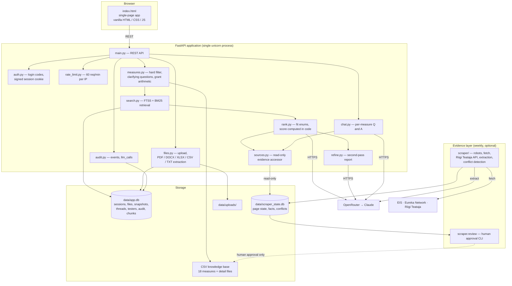

# AI Funding Advisor for Estonian Innovation Funding Measures

## Summary
| Company Name | [TODO: company name and website] |
| :--- | :--- |
| Development Team Lead Name | [TODO: team lead name and profile link] |
| Development Team Lead E-mail | [TODO: e-mail address] |
| Duration of the Demonstration Project | [TODO: month/year-month/year] |
| Final Report | [TODO: link to the final report PDF] |

> **Note before submitting:** the five fields above are the only placeholders left in this
> document. Replace every `[TODO: ...]` with the actual values.

# Description
## Objectives of the Demonstration Project

Estonia offers a large number of public funding instruments for enterprise innovation.
They range from under €10,000 to several million euros and differ in co-financing rates,
suitability for different company types and project types, and in their conditions —
intellectual property, the need for partners, or the requirement to involve a research
institution. This makes the funding landscape hard to navigate. Finding a suitable
measure usually means working through regulations, guidelines, agency web pages and other
underlying documents, and then judging whether a specific project, company and
cooperation model actually meet the measure's conditions. In practice only experienced
advisors can do this, and even for them the work is time-consuming and requires reading
the same conditions over and over again.

The objective of the project was to build an AI-based solution that collects the public
web materials, guidelines, regulations and other relevant documents connected to funding
sources, and builds on top of them a system that can propose suitable funding sources
while taking into account the content, parties, size and goal of the project. A key
requirement was that every recommendation comes with a clear justification and references
to the original sources, so that the user understands *why* a particular measure might
fit.

The solution was intended first for internal use by the business cooperation team. If the
prototype proves useful and trustworthy enough, it can later be used more widely, for
example in innovation advisory work or in the context of public services.

## Activities and Results of the Demonstration Project
### Challenge

The challenge was not merely collecting information, but designing and building a
multi-part AI-based decision-support prototype. It required gathering information about
every known funding source from its web sources, consolidating and structuring the
information about the same funding source into a single knowledge base, processing
documents and regulations so that the system can actually reason over them, building a
search/RAG solution that finds the most relevant measures from a user's input, designing
the conversation logic (what the system asks the user, when clarifying questions are
needed), creating the scoring logic so that results are not only found but also ranked,
and designing an explainable output where every recommendation carries an understandable
justification, citations and source references.

**How the approach changed during the project.** Two assumptions from the initial brief
did not survive contact with the actual sources, and the design was changed accordingly:

1. **Pure scraping was not enough as a knowledge base.** The measure conditions that
   matter for eligibility (applicant type, company size, region, excluded sectors,
   co-financing) are scattered across agency pages and legal acts in prose form and are
   not reliably extractable. The knowledge base was therefore built as a **hand-curated
   CSV layer**, and automatic scraping was kept as a **separate evidence layer** that
   refreshes on its own but never overwrites the curated values without a human review
   step. The two layers have deliberately different trust levels.
2. **A vector database was dropped on purpose.** The chosen LLM route (OpenRouter)
   exposes only chat completions, and Anthropic has no embeddings API, so dense vectors
   would have required a third provider or a locally hosted model for a knowledge base of
   18 measures. Lexical retrieval (SQLite FTS5 + BM25) ships with the Python standard
   library's `sqlite3` and was sufficient at this scale. `search.rank_measures()` is the
   single function an embedding backend would replace.

A third change came from piloting: because testers upload real company documents, the
prototype gained an access gate, an audit trail of every model call, and a private
network deployment (see *Technological Results*).

### Data Sources

- **Curated measure knowledge base** (`rahastusmeetmed/`) — a master CSV of **18 funding
  measures** with 23 structured columns (funder, maximum grant, co-financing %, status,
  eligible applicant, company size, region, sector, field, project type, AI / R&D /
  partner / university requirements, development phase, excluding conditions,
  checkpoints, links), plus one detail CSV per measure in the form
  *field | suggested value | confidence | justification*, where each justification cites
  the source it came from.
- **[EIS](https://eis.ee)** — the funding agency's measure pages (15 of the measures).
- **[Eureka Network](https://www.eurekanetwork.org)** — international calls (2 measures).
- **[Riigi Teataja](https://www.riigiteataja.ee)** — the legal acts behind the measures
  (13 unique acts). In total 33 monitored sources.
- **Documents uploaded by the user** — company and project files (PDF, DOCX, XLSX, CSV,
  TXT, MD; max 10 MB per file) used as additional context for a single session only.

### AI Technologies

- **Claude (Anthropic), accessed through [OpenRouter](https://openrouter.ai)** — used for
  the three tasks where the answer genuinely depends on the *content* of the project
  rather than on a rule: judging semantic fit, writing the Estonian-language
  justification, and answering follow-up questions about a single measure. The transport
  layer (`backend/llm.py`) is plain HTTP with no vendor SDK dependency, and supports the
  Anthropic API directly as an alternative provider, so the model can be swapped without
  touching the application logic. Concurrent model calls are capped
  (`LLM_MAX_CONCURRENCY`, default 4) because each call holds a worker thread for up to
  60 seconds.
- **Lexical retrieval: SQLite FTS5 + BM25** (`backend/search.py`) — each measure is split
  into chunks (the master row plus every detail-file row), indexed with FTS5 and scored
  with `bm25()`; the top `RAG_TOP_N` (default 10) measures reach the ranking call. The
  index is rebuilt at startup only if the CSV files have changed. Justification: at this
  corpus size lexical search is accurate enough, needs no external service, and adds no
  dependency — while a vector store would have added a third provider purely for
  embeddings.
- **Constrained LLM output instead of free-form scoring** (`backend/rank.py`) — the model
  does not produce the score. For every candidate measure it returns three enumerated
  judgements (`project_type_fit`, `field_fit`, `purpose_fit`, each one of
  `yes | partial | no | unknown`), an explanation and 2–4 checkpoints. The application
  code maps the enums to points (15 / 8 / 5 / 0) and derives the displayed 1–5 score from
  fixed thresholds. This makes the score reproducible and far less dependent on which
  model is used.
- **Deterministic rules before and around the model** (`backend/measures.py`) — a hard
  filter removes measures the applicant cannot qualify for at all (closed measure, wrong
  applicant type, large enterprise vs SME-only measure, excluded region, excluded
  sector). Grant-amount arithmetic — the requested sum against the measure's ceiling and
  co-financing rate — is computed in code and handed to the model as a finished verdict,
  because it was previously three raw strings for the model to compare. Clarifying
  questions are generated from rules, only when a surviving measure actually has the
  corresponding requirement.
- **LLM-based extraction with verified citations** (`scraper/extract.py`) — the scraper
  uses the model to extract field values from source pages, but every extracted fact must
  carry a verbatim quotation that is checked to actually occur in the fetched source
  text; facts that fail this check are dropped. Extraction runs only when a source's
  cleaned-text hash has changed, and then once per measure rather than once per source,
  so an unchanged week costs zero model calls.
- **Document text extraction** — `pypdf`, `python-docx`, `openpyxl` for PDF, DOCX and
  XLSX uploads.

**Hallucination control** is a design rule throughout: everything displayed to the user as
a fact (grant amounts, co-financing percentages, status, links) comes from the CSV
knowledge base, never from model output. The model contributes fit judgements,
explanations and checkpoints only, and results whose measure name cannot be matched back
to a known measure are discarded.

### Technological Results

- **The full pipeline works end to end** and was tested by advisors on real cases: intake
  → hard filter → clarifying questions → retrieval → ranked recommendations with
  justifications and source links → per-measure follow-up chat → an optional second-pass
  report.
- **Automated test suite** covering the backend, the scraper and the maintenance tools
  (`pytest backend/ scraper/ tools/`). Every test runs offline — network access and model
  calls are mocked — so the suite requires no API key and cannot incur cost. Coverage
  includes the two-stage recommendation flow, snapshot locking, thread handling, the
  rate limiter, file extraction, access control, the grant-range verdict, the scraper's
  robots.txt evaluation, redaction resolution, citation verification, and the cost
  guarantees (first run extracts once per measure; an unchanged run makes zero model
  calls).
- **A knowledge-base validator** (`python -m tools.check_measures`, also run as part of
  the test suite) catches the silent CSV errors that would otherwise surface as broken
  behaviour: a detail file that did not match any master row, duplicate measure names,
  unknown status or applicant values, links without a scheme, and Riigi Teataja links
  that do not resolve to the current redaction.
- **A concrete finding from validating the source layer:** at implementation time
  **10 of the 13 linked legal acts had been superseded** by newer redactions — one of them
  since 2021. The CSV links whichever redaction was current when it was written, and
  amending an act mints a new ID. The scraper therefore always resolves and reads the
  currently valid redaction, and the interface tells the user which redaction they are
  looking at. This alone justifies the automated source layer: a hand-curated base drifts
  out of date without anyone noticing.
- **Riigi Teataja required a non-obvious solution.** Its act pages are an Angular
  single-page application — ordinary HTML scraping returns roughly 35 characters of empty
  shell. The scraper uses the public API instead
  (`/public-api/api/v1/akt/{id}?leiaKehtiv=true` → `kehtivId` → `/blob-html`), which
  yields the full text of the valid redaction along with its title.
- **Validated in a real pilot deployment.** The application runs in Docker behind a
  Tailscale sidecar using `tailscale serve` **without** Funnel, so it is reachable only
  from devices explicitly authorised into the private network and is not exposed to the
  public internet at all. Access is further gated per tester by individually issued login
  codes, stored only as keyed hashes.
- **Every model call is auditable.** Two tables record the pilot: `events` (one row per
  request — who, when, what, status, duration) and `llm_calls` (one row per model call —
  model, full prompt and response, tokens, price, latency), linked by request ID. This is
  what makes an evidence-based evaluation of answer quality possible, and it is also the
  basis for cost measurement. Retention is bounded: uploaded content and logs are purged
  after 90 days (`python -m tools.purge`), the retention period is stated in the consent
  text on the login page, and backups are handled by `python -m tools.backup`.

### Technical Architecture

The system is a single FastAPI application serving one static HTML page, with SQLite for
all persistence and no build step on the frontend. It runs deliberately as a single
uvicorn process: the rate limiter and the scraper scheduler hold in-process state and
SQLite prefers a single writer. Concurrency comes from the Starlette thread pool, further
limited by `LLM_MAX_CONCURRENCY`.

Components:

- **Frontend** — `frontend/index.html`, a single-page application in vanilla HTML / CSS /
  JavaScript, in Estonian.
- **API layer** — `backend/main.py` (FastAPI routes), `backend/auth.py` (login codes,
  signed session cookies), `backend/rate_limit.py` (60 requests/minute per client),
  `backend/audit.py` (event and model-call logging).
- **Recommendation pipeline** — `backend/measures.py` (CSV loading, hard filter,
  clarifying questions, grant arithmetic), `backend/search.py` (FTS5/BM25 retrieval),
  `backend/rank.py` (fit judgement and scoring), `backend/refine.py` (second-pass "what
  would have to change" report), `backend/chat.py` (per-measure Q&A).
- **Evidence layer** — `scraper/` (robots.txt evaluation, conditional fetching, Riigi
  Teataja API resolution, extraction, conflict detection, weekly scheduler, human review
  CLI) writing to its own database, read back through `backend/sources.py` **read-only**,
  so a web request can never block a scraper write and the application behaves exactly as
  before if the scraper never runs.
- **Storage** — `data/app.db` (sessions, files, recommendations, threads, testers, audit
  log, search index), `data/scraper_state.db` (source state, extracted facts, conflicts,
  pending changes), `data/uploads/` (per-session upload folders), and the CSV knowledge
  base.
- **Deployment** — Docker Compose with a Tailscale sidecar; the application container has
  no published ports and shares the sidecar's network namespace.

A detailed technical description — module by module, with data-flow diagrams, the
database schema and the API reference — is in [architecture.md](architecture.md) in this
repository.

### User Interface

A separate web interface was developed: one page, in Estonian, that the advisor opens in
a browser. There is no installation and no separate client. The flow is:

1. **Log in** with a personal code issued to that tester.
2. **Fill in the intake form** — applicant type, company size, region, the grant amount
   applied for, and a free-text description of the project's content, goal, parties and
   size.
3. **Optionally upload company documents** (PDF, DOCX, XLSX, CSV, TXT, MD). Their text is
   used as context for the recommendation and for the follow-up chat.
4. **Answer clarifying questions** — generated from rules (R&D, AI, partner, development
   phase and so on), asked only when a surviving measure actually depends on the answer.
   The interface first shows how many measures passed the hard filter, and the user can
   skip the questions.
5. **Read the recommendations** — ranked cards, each with a 1–5 fit score, an
   Estonian-language justification, 2–4 checkpoints to verify manually before applying,
   the factual figures from the knowledge base (maximum grant, co-financing, status),
   links to the official source, and a freshness/conflict banner when the automatic source
   layer disagrees with the stored values. Measures that were filtered out are still
   listed, with the reason.
6. **Ask follow-up questions about a single measure** in a chat panel. This is where the
   evidence layer pays off: the entire current legal act is available in the context, so a
   question such as "is a foreign service provider eligible?" can be answered with a
   citation to the specific section.
7. **Request a second-pass report** — the user ticks the measures they are interested in
   and asks the opposite question: what would have to change in the project for this
   measure to fit. The model may only propose changes to the project itself (goal, project
   type, development phase, R&D / AI / partner / university dimensions); the company facts
   the hard filter ran on are locked, because an applicant cannot edit them in a document.
8. **Download the summary** as a Markdown file, or continue later.

Sessions ("vestlus") have an 8-character code. An unsaved session is a private draft; a
saved session gets a name, appears in the owner's list, and its code can be shared with
another logged-in tester for read-only access.

### Future Potential of the Technical Solution

- **Wider advisory use** — the same tool beyond the internal team, in innovation advisory
  work and in public services, once the recommendations are validated as trustworthy
  enough.
- **Extending the knowledge base** to other funding domains — the CSV schema, the hard
  filter and the scraper are not specific to innovation funding; adding a measure means
  adding a row and its sources, not writing code.
- **Automated monitoring of legal-act changes** as a standalone benefit — the evidence
  layer already detects when an act behind a measure has been amended, which is useful to
  anyone maintaining funding documentation, independently of the recommendation feature.
- **Reuse of the pattern in other eligibility-heavy domains** — permits, licensing,
  procurement, compliance: wherever eligibility rules live in prose across many documents
  and the decision must be explainable and traceable to a source.
- **Improving the ranking quality** along the path already documented in
  [evaluating-approach.md](evaluating-approach.md): extending the deterministic part of
  the score and reducing what is left to model judgement.

### Lessons Learned

**The technological solution did address the initial challenge.** The prototype produces
ranked, justified and source-referenced funding recommendations from a project
description, which is what the project set out to build, and it does so in a form that an
advisor can check rather than having to trust. The main lessons:

- **Keeping facts out of the model was the single most important decision.** Numbers,
  statuses and links come from the knowledge base; the model contributes judgement and
  language. Where the model was originally given raw figures to compare, moving that
  arithmetic into code removed a whole class of confident-sounding errors.
- **Constraining the model's output makes results reproducible.** Replacing "select, rank
  and score these measures" with three enumerated fit judgements per measure, mapped to
  points in code, reduced run-to-run and model-to-model variance considerably. It also
  makes the tool much less sensitive to which model is configured — relevant when the
  operating cost is a real constraint.
- **A curated knowledge base plus an automatically refreshed evidence layer beats either
  one alone.** Scraping alone could not produce reliable structured eligibility fields;
  manual curation alone silently goes stale, as the 10 superseded legal acts showed.
  Separating the two, with different trust levels and a human gate on anything displayed,
  resolved the tension.
- **Working the problem through with the client came before choosing an architecture.**
  Regular discussions with the business cooperation team were what turned a broad wish —
  "find suitable funding measures" — into a problem precise enough to build for: the
  bottleneck was never finding the agency pages, it was judging whether a specific
  project meets a measure's conditions and being able to show why. That shared
  understanding is what settled the architecture — a curated knowledge base separated
  from an automatically refreshed evidence layer, with every recommendation traceable to
  its source — rather than any assumption carried in from the initial brief.

# Custom agreement with the AIRE team
*If you have a unique project or specific requirements that don't fit neatly into the Docker file or description template options, we welcome custom agreements with our AIRE team. This option allows flexibility in collaborating with us to ensure your project's needs are met effectively.*

*To explore this option, please contact our demonstration projects service manager via katre.eljas@taltech.ee with the subject line "Demonstration Project Custom Agreement Request - [Your Project Name]." In your email, briefly describe your project and your specific documentation or collaboration needs. Our team will promptly respond to initiate a conversation about tailoring a solution that aligns with your project goals.*
