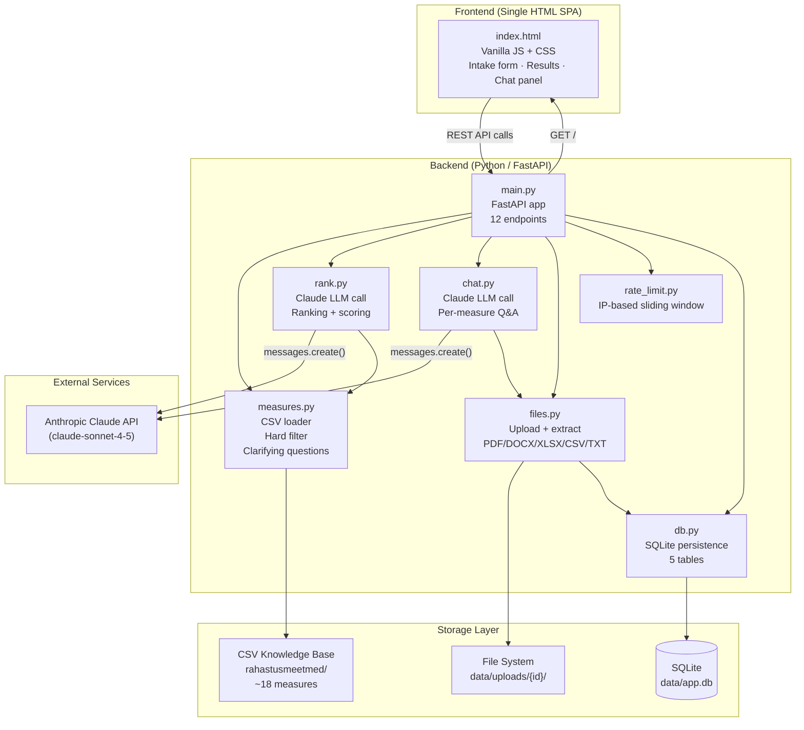
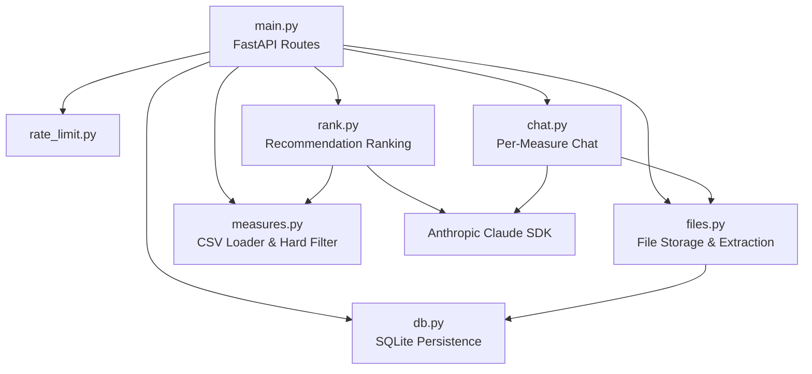
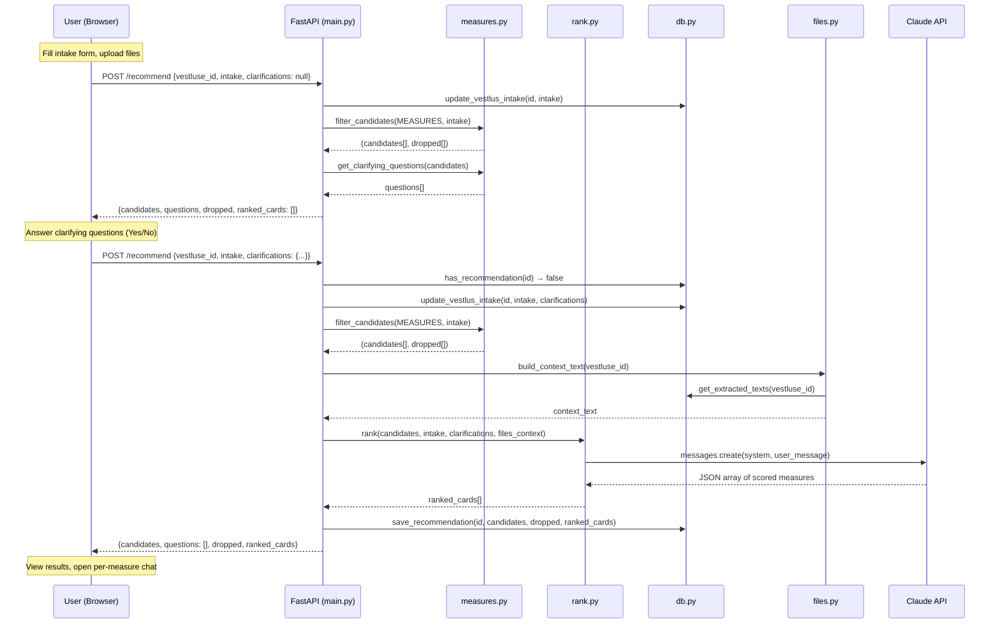
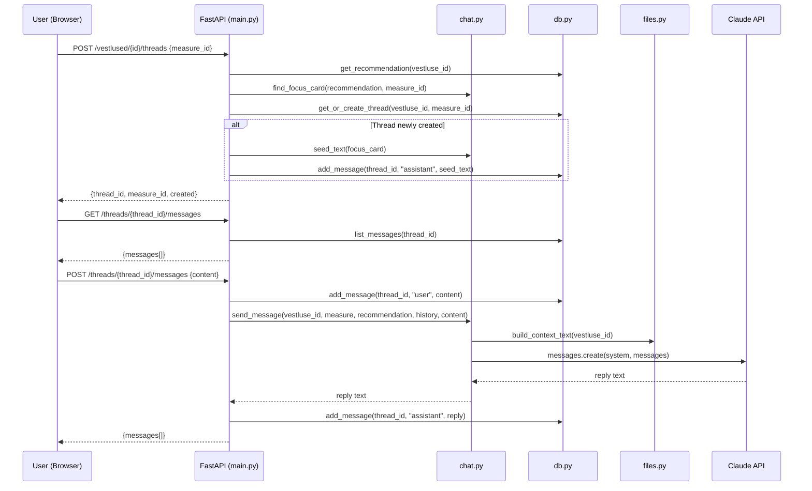
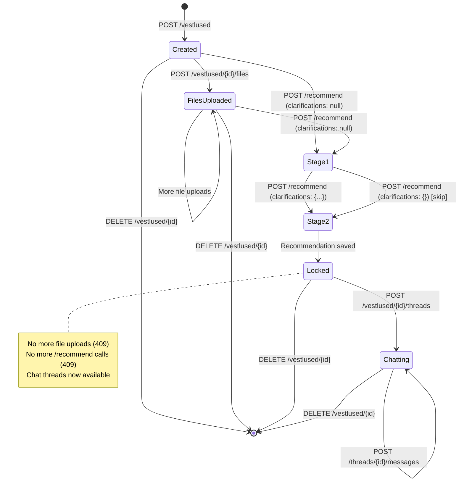

# Rahastusmeetmed — Project Architecture

> **Purpose**: AI-powered funding advisor for Estonian innovation funding measures.
> **Organization**: ATI (Estonian Agency for Technology and Innovation) – internal tool for the business cooperation team.
> **Language**: Estonian UI and data; English code and comments.
> **Last updated**: 2026-07-21

---

## Table of Contents

1. [Project Overview](#1-project-overview)
2. [High-Level Architecture](#2-high-level-architecture)
3. [Tech Stack](#3-tech-stack)
4. [Directory Structure](#4-directory-structure)
5. [Backend Architecture](#5-backend-architecture)
   - 5.1 [Entry Point — main.py](#51-entry-point--mainpy)
   - 5.2 [Database — db.py](#52-database--dbpy)
   - 5.3 [Data & Filtering — measures.py](#53-data--filtering--measurespy)
   - 5.4 [LLM Ranking — rank.py](#54-llm-ranking--rankpy)
   - 5.5 [Per-Measure Chat — chat.py](#55-per-measure-chat--chatpy)
   - 5.6 [File Upload & Extraction — files.py](#56-file-upload--extraction--filespy)
   - 5.7 [Rate Limiting — rate_limit.py](#57-rate-limiting--rate_limitpy)
6. [Frontend Architecture](#6-frontend-architecture)
7. [Data Flow Diagrams](#7-data-flow-diagrams)
8. [Data Model](#8-data-model)
9. [API Reference](#9-api-reference)
10. [Configuration & Environment](#10-configuration--environment)
11. [Database Schema](#11-database-schema)
12. [Error Handling](#12-error-handling)
13. [Security Considerations](#13-security-considerations)
14. [Testing](#14-testing)
15. [Known Limitations & Planned Improvements](#15-known-limitations--planned-improvements)
16. [How to Run](#16-how-to-run)
17. [Glossary (Estonian → English)](#17-glossary-estonian--english)

---

## 1. Project Overview

Estonia has many different innovation funding sources for enterprises. They range from under €10,000 to several million euros and differ in co-financing requirements, eligibility criteria (company size, IP requirements, partnership needs, R&D involvement), and application conditions. Navigating this landscape is complex — even for experienced advisors.

**Rahastusmeetmed** is an AI-powered internal tool that:

1. Collects structured information about a user's project (type, company size, region, budget, description)
2. Optionally accepts uploaded company documents (PDF, DOCX, XLSX, CSV, TXT) for additional context
3. Deterministically filters ~18 known funding measures against hard eligibility rules
4. Uses Claude (Anthropic LLM) to rank and score the surviving measures based on semantic project fit
5. Presents ranked recommendations with scores, explanations, checkpoints, and source links
6. Allows per-measure follow-up Q&A via a dedicated chat panel scoped to a single measure's details

The tool is session-based — each session ("vestlus") has a unique 5-character code that users can share or resume later. Once recommendations are generated, the session is locked: no further file uploads or re-recommendations are allowed (a new session is required).

---

## 2. High-Level Architecture



### Core Concepts

| Concept | Description |
|---------|-------------|
| **Vestlus** | A session/project identified by a 5-character alphanumeric code (e.g., `AB3K9`). Contains intake form data, uploaded files, one immutable recommendation snapshot, and zero or more per-measure chat threads. |
| **Recommendation Lock** | Once a recommendation snapshot is generated (Stage 2 of `/recommend`), the vestlus is locked — no more file uploads or re-recommendations. A new vestlus is required. |
| **Two-Call Protocol** | Recommendations are generated in two API calls: Stage 1 (hard-filter, return questions) → Stage 2 (Claude ranking, lock session). |
| **Hallucination Prevention** | Display fields (grant amounts, co-financing %, status, links) are always sourced from CSV data, never from LLM output. The LLM only provides scores, explanations, and checkpoints. |

---

## 3. Tech Stack

| Layer | Technology | Version / Notes |
|-------|-----------|----------------|
| **Backend** | Python + FastAPI | `fastapi>=0.115`, `uvicorn[standard]>=0.30` |
| **LLM** | Anthropic Claude | `anthropic>=0.40`, default model: `claude-sonnet-4-5` |
| **Database** | SQLite | Via Python `sqlite3` stdlib, stored at `data/app.db` |
| **File Extraction** | pypdf, python-docx, openpyxl | PDF, DOCX, XLSX text extraction |
| **Frontend** | Vanilla HTML/CSS/JS | Single `index.html` file (881 lines), no build step |
| **Data** | CSV files | UTF-8, loaded once at startup into memory |
| **Config** | `.env` file | `ANTHROPIC_API_KEY`, optional `CLAUDE_MODEL` |
| **Dependencies** | python-dotenv, python-multipart | `.env` loading, file upload handling |

---

## 4. Directory Structure

```
rahastusmeetmed/                        # Project root
├── .env                                # Secrets (ANTHROPIC_API_KEY) — git-ignored
├── .env.example                        # Template for .env
├── .gitignore
├── requirements.txt                    # Python deps (8 packages)
├── README.md                           # Setup & run instructions
├── architecture.md                     # This file
├── esialgneinfo.md                     # Project brief (Estonian) — background, goals, scope
├── evaluating-approach.md              # Evaluation methodology — current vs proposed approach
│
├── scraper/                            # Source-scraping evidence layer (optional)
│   ├── config.py                       # Paths, User-Agent (ASCII only!), budgets, high-risk fields
│   ├── robots.py                       # robots.txt evaluator (wildcards, group selection)
│   ├── fetch.py                        # robots check, rate limit, conditional GET, HTML→text
│   ├── riigiteataja.py                 # SPA bypass: resolve current redaction via public API
│   ├── db.py                           # page_state, measure_facts, source_conflicts, pending_changes, meta
│   ├── extract.py                      # LLM extraction + deterministic conflict detection
│   ├── run.py                          # Cycle orchestrator (python -m scraper.run)
│   ├── review.py                       # Human review CLI (python -m scraper.review)
│   ├── scheduler.py                    # Background thread, gated by SCRAPER_ENABLED
│   └── test_scraper.py                 # Offline tests (network + LLM mocked)
│
├── backend/                            # Python backend package
│   ├── __init__.py                     # Empty package marker
│   ├── main.py                         # FastAPI app, 12 routes, Pydantic schemas
│   ├── sources.py                      # Read-only accessor: scraper evidence → prompts
│   ├── db.py                           # SQLite persistence (5 tables, CRUD operations)
│   ├── measures.py                     # CSV loader, fuzzy merge, hard-filter, question gen
│   ├── rank.py                         # Claude ranking call, prompt engineering, response parsing
│   ├── chat.py                         # Claude per-measure chat, context assembly, history mgmt
│   ├── files.py                        # File upload, text extraction, disk storage
│   ├── rate_limit.py                   # In-memory IP-based sliding window rate limiter
│   ├── conftest.py                     # Shared pytest fixtures (auto-reset rate limiter)
│   ├── test_chat_helpers.py            # Tests for chat.py utility functions
│   ├── test_db.py                      # Tests for SQLite CRUD, cascade deletes, ID generation
│   ├── test_files.py                   # Tests for file extraction, validation, context building
│   ├── test_measure_id.py             # Tests for measure ID generation from filenames
│   ├── test_previously_applied.py     # Tests for previously-applied measure filtering
│   ├── test_rate_limit.py             # Tests for sliding window rate limiter
│   ├── test_recommend_api.py          # Tests for /recommend 2-call flow, snapshot locking
│   └── test_threads_api.py            # Tests for thread CRUD, message seeding, LLM error handling
│
├── frontend/
│   └── index.html                      # Full SPA: HTML + CSS + JS (881 lines)
│
├── rahastusmeetmed/                    # Data directory (CSV knowledge base)
│   ├── Rahastusmeetmed_koik.csv        # Master table — ~18 measures, 28 columns
│   ├── 02 - Innovatsiooniosak.csv      # Detail file — per-measure enrichment
│   ├── 03 - Arendusosak.csv
│   ├── 04 - Digitaliseerimise teekaardi toetus.csv
│   ├── 05 - Digitaliseerimise teekaardi toetus.csv
│   ├── 06 - RUP väikeprojektide taotlusvoor.csv
│   ├── 07 - RUP.csv
│   ├── 08 - Üliõpilaste inseneri valdkonna.csv
│   ├── 09 - Kaitsetööstuse tootearenduse to.csv
│   ├── 10 - Tootearendustoetus Eurostars.csv
│   ├── 11 - (Ettevõtja) tootearenduse toetu.csv
│   ├── 12 - VKE arenguprogramm.csv
│   ├── 13 - Ettevõtte arenguprogramm.csv
│   ├── 14 - Ettevõtja teadus- ja arendustöö.csv
│   ├── 15 - Ettevõtte investeeringu toetus.csv
│   ├── 16 - Suuremahuliste investeeringute.csv
│   ├── Rahastusmeetmed_Biotech_Call_September_2026.csv
│   └── Rahastusmeetmed_Transnational_Eureka_Lightweighting_Call_2026.csv
│
├── data/                               # Runtime data (git-ignored)
│   ├── app.db                          # SQLite database
│   └── uploads/                        # Uploaded user files
│       └── {vestluse_id}/              # Per-session upload folders
│
├── docs/
│   └── superpowers/                    # Sprint notes and implementation plans
│       ├── rahastusmeetmed_2026-07-07.md
│       ├── rahastusmeetmed_2026-07-07 (1).md
│       ├── rahastusmeetmed_2026-07-08.md
│       └── rahastusmeetmed_2026-07-15.md
│
└── katsetused/                         # Experiment/test output logs
```

---

## 5. Backend Architecture

### Module Dependency Graph



---

### 5.1 Entry Point — `main.py`

**Role**: FastAPI application with 12 endpoints managing the full vestlus lifecycle.

**Startup sequence**:
1. `load_dotenv()` loads `.env` file
2. `FastAPI()` app instance is created
3. `measures.load_measures()` reads all CSVs into the global `MEASURES` list (once, at import time)
4. `FRONTEND` path is resolved to `frontend/index.html`

**Pydantic request schemas**:

```python
class RecommendRequest(BaseModel):
    vestluse_id: str
    intake: dict
    clarifications: dict | None = None  # None = Stage 1; dict = Stage 2

class ThreadCreateRequest(BaseModel):
    measure_id: str

class MessageCreateRequest(BaseModel):
    content: str
```

**Key workflow in `POST /recommend`**:

1. Validate vestlus exists and has no existing recommendation snapshot
2. Save/update intake form data in DB
3. Run `measures.filter_candidates(MEASURES, intake)` → `(candidates, dropped)`
4. **If `clarifications` is `None`** (Stage 1):
   - Generate deterministic clarifying questions
   - Return `{candidates, questions, dropped, ranked_cards: []}`
   - **No LLM call, nothing persisted beyond intake**
5. **If `clarifications` is a `dict`** (Stage 2):
   - Build file context from uploaded documents
   - Call `rank(candidates, intake, clarifications, files_context)` → Claude API
   - Save immutable recommendation snapshot to DB
   - Return `{candidates, questions: [], dropped, ranked_cards}`

**Key workflow in `POST /threads/{thread_id}/messages`**:

1. Validate thread exists and recommendation exists
2. Look up the measure by ID
3. Fetch capped message history (last 20 messages)
4. If history is empty, re-seed the initial assistant pitch message
5. Save user message to DB
6. Call `chat.send_message(...)` → Claude API
7. On success: save assistant reply to DB
8. On failure: raise `502`, but user message is preserved

---

### 5.2 Database — `db.py`

**Role**: SQLite persistence layer managing vestlused (sessions), files, recommendations, chat threads, and messages.

**Storage paths**:
- Database: `data/app.db` (relative to project root)
- Uploads: `data/uploads/{vestluse_id}/{filename}`

**Connection setup**:
- `row_factory = sqlite3.Row` for dict-like access
- `PRAGMA foreign_keys = ON` for cascade deletes
- Directories auto-created on `init_db()`

**Vestluse ID generation**:
- 5-character random string from uppercase letters + digits (`[A-Z0-9]`)
- ~60 million possible combinations
- Collision retry up to 50 attempts

**Key functions**:

| Function | Purpose |
|----------|---------|
| `create_vestlus(title)` | Insert new session, return 5-char ID |
| `get_vestlus(id)` | Fetch session with parsed JSON fields |
| `update_vestlus_intake(id, intake, clarifications)` | Update intake/clarification JSON |
| `delete_vestlus(id)` | Delete session + cascade + remove upload folder |
| `has_recommendation(id)` | Check if recommendation snapshot exists |
| `save_recommendation(id, candidates, dropped, ranked_cards)` | Insert immutable snapshot (raises `ValueError` if exists) |
| `get_recommendation(id)` | Fetch recommendation with parsed JSON |
| `add_file(id, name, path, text, status)` | Record uploaded file metadata |
| `get_extracted_texts(id)` | Get all successfully extracted file texts |
| `get_or_create_thread(vestluse_id, measure_id)` | Idempotent thread creation (handles race conditions) |
| `add_message(thread_id, role, content)` | Insert chat message |
| `list_messages(thread_id, limit)` | Get messages with optional tail limit |
| `clear_thread_messages(thread_id)` | Delete all messages in a thread |

---

### 5.3 Data & Filtering — `measures.py`

**Role**: Loads CSV knowledge base into memory, merges master and detail files, provides deterministic hard-filtering and clarifying question generation.

#### Data Loading (`load_measures()`)

1. Reads the **master CSV** (`Rahastusmeetmed_koik.csv`) — ~18 rows, 28 columns
2. Parses each row into a dict with named fields (see [Data Model](#8-data-model))
3. Calls `_merge_detail_files(measures)` to attach enrichment data from per-measure detail CSVs

#### Detail File Merging

- Each per-measure CSV has a vertical key-value structure with columns: `Väli`, `Soovitatud väärtus`, `Kindlus`, `Põhjendus`
- **Measure ID derivation**: Leading digits from filename (e.g., `"02"` from `"02 - Innovatsiooniosak.csv"`), or snake_case stem for unnumbered files
- **Fuzzy matching**: Uses `difflib.get_close_matches(cutoff=0.6)` to match detail file names to master measure names (handles minor spelling differences, dashes, parentheses, word order)
- Attached as a `detail` list on each measure dict

#### Master CSV Schema (28 columns)

| Index | Column (Estonian) | Python Key | Purpose |
|-------|------------------|-----------|---------|
| 0 | Rahastaja | `funder` | Funding body (e.g., "EIS") |
| 1 | Meetme nimetus | `name` | Measure name |
| 3 | Suurim toetus (€) | `max_grant` / `max_grant_eur` | Maximum grant amount |
| 4 | Omafinantseering (%) | `cofinancing` | Co-financing requirement |
| 5 | Kogu toetussumma (€) | `total_budget` | Total budget of the measure |
| 6 | Staatus | `status` | "avatud" / "tulemas" / "suletud" |
| 7 | Meetme kirjeldus | `description` | Long description |
| 8 | Link | `link` | Primary URL |
| 9 | Sobiv taotleja | `applicant` | Eligible applicant types text |
| 10 | Ettevõtte suurus | `size` | Company size requirement |
| 11 | Piirkond | `region` | Regional restrictions |
| 12 | Sektor | `sector` | Sector restrictions |
| 13 | Valdkond | `field` | Field/domain |
| 14 | Projekti tüüp | `project_type` | Project type |
| 15 | AI nõue | `ai` | AI requirement |
| 16 | T&A nõue | `rnd` | R&D requirement |
| 17 | Arengufaas | `phase` | Development phase (TRL) |
| 18 | Partneri nõue | `partner` | Partner requirement |
| 19 | Ülikoolipartner | `university` | University partner |
| 20 | Välistavad tingimused | `exclusions` | Exclusion conditions |
| 21 | Kontrollkohad | `checkpoints` | Verification checkpoints |
| 22+ | Täiendavad lingid | `links` | Additional links (multiple columns) |

#### Detail CSV Schema (per-measure enrichment)

| Column | Purpose |
|--------|---------|
| `Väli` | Field name (maps to master table columns) |
| `Soovitatud väärtus` | Standardized/verified value |
| `Kindlus` | Confidence level: "kõrge" (high) / "keskmine" (medium) / "madal" (low) |
| `Põhjendus` | Citation/justification (references EIS, Riigi Teataja, etc.) |

Each detail CSV also has a bottom section ("2) Ebaselged või kontrollimist vajavad kohad") listing specific ambiguities or items needing re-verification.

#### Hard Filter Algorithm (`filter_candidates()`)

Deterministic, conservative pre-filter — **no LLM involved**. Drops measures in this order:

| # | Check | Drop Reason |
|---|-------|-------------|
| 1 | **Excluded sector** | If `intake.excluded_sector_activity == "jah"` → drop ALL measures: `"ettevõtte tegevusala on välistatud valdkondades"` |
| 2 | **Previously applied** | If measure name in `intake.previously_applied` → `"varem taotletud"` |
| 3 | **Closed status** | If status contains `"suletud"` → `"meede on suletud"` |
| 4 | **Applicant type mismatch** | Parses applicant text into categories (ettevõte/MTÜ/SA/konsortsium). If intake type not in allowed set → `"sobib taotlejale: {applicant}"` |
| 5 | **Company size mismatch** | If `intake.company_size == "suur"` and measure is VKE-only → `"meede on ainult VKE-dele"` |
| 6 | **Regional exclusion** | Parses `"v.a"` (except) clauses in region text. If user's region matches excluded region → `"piirkond välistatud: {region}"` |

> **Design principle**: The filter is deliberately conservative. Ambiguous cases are kept and passed to the LLM for judgment. The filter does NOT check budget range, co-financing capability, or project description — those are left to Claude.

#### Clarifying Questions (`get_clarifying_questions()`)

Generated deterministically based on surviving candidates' field values:

| Trigger Field | Trigger Values | Question Topic |
|---------------|---------------|----------------|
| `rnd` | "nõutav", "jah" | R&D / TRL 3-7 involvement |
| `university` | "sobiv" | University partner availability |
| `partner` | "nõutav", "konsortsium nõutav" | Partner/consortium availability |
| `ai` | "sobib" | AI development component |
| `phase` | >2 distinct phases across candidates | Development phase specification |

---

### 5.4 LLM Ranking — `rank.py`

**Role**: Single Claude API call that ranks pre-filtered candidate measures against the user's project.

#### Architecture

- One Claude call with all surviving candidates in a single prompt
- System prompt instructs model to: pick top 5, score 1–5, explain in Estonian, list 2–4 checkpoints, respond as strict JSON array
- `max_tokens=2000`

#### Prompt Construction (`build_user_message()`)

Assembles a structured prompt containing:
1. **Project intake**: applicant type, company size, region, budget, co-financing, project description
2. **Clarification answers** (if any)
3. **Uploaded file context** (extracted text from user documents)
4. **Candidate blocks**: One per measure with all structured fields + detail rows with confidence ratings and citations

#### Response Processing

1. Parses JSON from Claude's response (tolerates ` ```json ` fences, extracts array via regex fallback)
2. Matches returned measure names to candidates via **fuzzy normalized matching** (`_norm()` — lowercases, converts dashes, strips parens, collapses whitespace)
3. **Merges LLM output with verbatim CSV data**: Score, explanation, and checks come from LLM; display fields (grant, co-financing, status, links) come directly from CSVs
4. Unknown names from LLM are silently dropped
5. Flags measures with "tulemas" status as `status_warning: true`

#### Expected LLM Response Format

```json
[
  {
    "name": "Measure Name",
    "score": 4,
    "explanation": "Estonian explanation of why this measure fits...",
    "checks": ["Checkpoint 1", "Checkpoint 2", "Checkpoint 3"]
  }
]
```

---

### 5.5 Per-Measure Chat — `chat.py`

**Role**: Claude-backed Q&A chat scoped to one specific funding measure within one vestlus.

#### Thread Scoping

Each chat thread is tied to:
- One `vestluse_id` (session)
- One `measure_id` (funding measure)
- The vestlus must have an existing recommendation snapshot

The model only ever sees:
- The **focus measure's** detail CSV data
- The user's **uploaded files** content
- The **other ranked cards'** name/score/explanation/checks for comparison
- **Never the full measure catalog**

#### System Prompt Construction (`build_system_context()`)

Assembles context from multiple sources:
1. Base `SYSTEM_PROMPT` (Estonian, instructs model to be a funding measure advisor)
2. Focus measure detail block (all `väli | väärtus | kindlus | põhjendus` rows)
3. Original evaluation from recommendation (explanation + checks)
4. Uploaded file contents via `files.build_context_text(vestluse_id)`
5. Comparison block of other ranked measures (name, score, explanation, checks)

#### Message History Management

- Capped at `MAX_HISTORY_MESSAGES = 20` messages
- `_to_api_messages()` cleans history for the Anthropic API:
  - Strips non-user/assistant roles
  - Drops leading assistant turns (conversation must start with user)
  - Collapses consecutive same-role messages (keeps latest)

#### Thread Lifecycle

1. **Creation**: `POST /vestlused/{id}/threads` with `measure_id`
2. **Seeding**: On creation, an initial assistant message is auto-generated from the measure's explanation and checkpoints via `seed_text(focus_card)`
3. **Q&A**: User sends messages via `POST /threads/{id}/messages`, receives Claude responses
4. **Clear**: `DELETE /threads/{id}/messages` removes all messages; next user message re-seeds

---

### 5.6 File Upload & Extraction — `files.py`

**Role**: Handles file uploads, validates types/sizes, extracts text content synchronously, stores files on disk.

#### Supported Formats

| Extension | Extraction Method |
|-----------|------------------|
| `.txt`, `.md` | UTF-8 decode with `errors="replace"` |
| `.pdf` | `pypdf.PdfReader` — extracts text from all pages |
| `.docx` | `python-docx` — extracts paragraph text |
| `.xlsx` | `openpyxl` — reads all sheets, joins cell values |
| `.csv` | `csv.reader` — joins cells with commas |

#### Limits

| Limit | Value |
|-------|-------|
| Max file size | 10 MB (`MAX_FILE_BYTES`) |
| Max stored text per file | 80,000 characters (`MAX_STORED_TEXT_CHARS`) |
| Max combined context for LLM | 80,000 characters (`MAX_CONTEXT_CHARS`) |

#### Text Truncation Strategy

When text exceeds limits, **front-truncation** is applied (the beginning is cut, the tail is kept). This ensures the most recent/relevant content is preserved.

#### Upload Flow

1. Validate file extension against `ALLOWED_EXTENSIONS`
2. Check file size against `MAX_FILE_BYTES`
3. Save file to disk: `data/uploads/{vestluse_id}/{filename}`
4. Extract text synchronously — if extraction fails, file is stored with `status='extract_failed'` (UI shows warning, but recommendation/chat continues without it)
5. Record file metadata + extracted text in `user_files` DB table
6. Return `{id, name, status}`

#### Context Building (`build_context_text()`)

Fetches all successfully extracted texts for a vestlus from DB, combines them into a single string, and applies `MAX_CONTEXT_CHARS` front-truncation if needed. Used by both `rank.py` and `chat.py`.

---

### 5.7 Rate Limiting — `rate_limit.py`

**Role**: Simple in-memory IP-based rate limiter protecting all endpoints.

- **Algorithm**: Sliding window
- **Limit**: 60 requests per 60 seconds per client IP
- **Response on exceeded**: `HTTP 429 Too Many Requests`
- **Implementation**: `defaultdict(list)` storing timestamps per IP, pruned on each check
- **Test support**: `reset()` function clears all state (used by `conftest.py` fixture)

---

## 6. Frontend Architecture

### Overview

Single-file SPA at `frontend/index.html` — 881 lines of HTML + embedded `<style>` + embedded `<script>`. No framework, no build step. Served directly by FastAPI at `GET /`.

### Design System (CSS Variables)

```css
--bg: #0f172a;          /* Dark slate background */
--card: #1e293b;        /* Card background */
--line: #334155;        /* Borders and dividers */
--text: #e2e8f0;        /* Main readable text */
--muted: #94a3b8;       /* Secondary/hint text */
--accent: #38bdf8;      /* Primary blue (buttons, user bubbles) */
--accent2: #22c55e;     /* Green (scores, selected "Jah" states) */
--warn: #f59e0b;        /* Warning badges and checklist titles */
```

Dark glassmorphism theme with responsive layout (max-width 860px).

### UI Layout & Components

```
┌─────────────────────────────────────────────────────┬──────────────────┐
│                    Main Content                      │   Chat Panel     │
│                                                      │   (380px fixed   │
│  ┌──────────────────────────────────────────────┐   │    right drawer) │
│  │ Conversation Bar                              │   │                  │
│  │ [Session ID] [Copy] [Resume Input] [Delete]   │   │  ┌────────────┐ │
│  └──────────────────────────────────────────────┘   │  │ Chat Title  │ │
│                                                      │  ├────────────┤ │
│  ┌──────────────────────────────────────────────┐   │  │            │ │
│  │ Step 1: Intake Form                           │   │  │  Messages  │ │
│  │ • Applicant type (OÜ/MTÜ/SA/Konsortsium)     │   │  │  (scroll)  │ │
│  │ • Company size (Mikro/VKE/Suur)               │   │  │            │ │
│  │ • Region (15 Estonian counties)               │   │  ├────────────┤ │
│  │ • Excluded sector (Yes/No + sector list)      │   │  │ [Input]    │ │
│  │ • Previously applied (checkboxes from API)    │   │  │ [Send]     │ │
│  │ • File uploader (drag & drop, multi-file)     │   │  │ [Clear]    │ │
│  │ • Budget range (optional dropdown)            │   │  └────────────┘ │
│  │ • Co-financing capacity (optional text)       │   │                  │
│  │ • Project description (required textarea)     │   │                  │
│  │ [Otsi sobivaid meetmeid]                      │   │                  │
│  └──────────────────────────────────────────────┘   │                  │
│                                                      │                  │
│  ┌──────────────────────────────────────────────┐   │                  │
│  │ Step 2: Clarifying Questions (if any)         │   │                  │
│  │ • Yes/No toggle buttons per question          │   │                  │
│  │ [Koosta soovitused] [Jäta vahele]             │   │                  │
│  └──────────────────────────────────────────────┘   │                  │
│                                                      │                  │
│  ┌──────────────────────────────────────────────┐   │                  │
│  │ Step 3: Results                               │   │                  │
│  │ • Ranked cards with scores, explanations      │   │                  │
│  │ • Selection checkboxes                        │   │                  │
│  │ • "Küsi lisainfot" → opens chat panel ────────┼───┘                  │
│  │ • Collapsible dropped measures section        │                      │
│  │ [Laadi alla kokkuvõte (.md)] [Alusta uuesti]  │                      │
│  └──────────────────────────────────────────────┘                      │
└─────────────────────────────────────────────────────────────────────────┘
```

### JavaScript State & API Communication

**Global state variables**:

| Variable | Type | Purpose |
|----------|------|---------|
| `currentIntake` | `object` | Current intake form data |
| `currentQuestions` | `array` | Generated clarifying questions |
| `lastResults` | `object` | Last recommendation API response |
| `vestluseId` | `string` | Active 5-char session code |
| `uploadLocked` | `boolean` | Whether file uploads are locked (post-recommendation) |
| `currentThreadId` | `string` | Active chat thread ID |
| `currentChatTitle` | `string` | Active measure title for chat |

**API calls made by frontend**:

| Action | Endpoint | When |
|--------|----------|------|
| Create session | `POST /vestlused` | Page load (or resume from `localStorage`) |
| Load session | `GET /vestlused/{id}` | Page load with existing ID |
| Delete session | `DELETE /vestlused/{id}` | "Kustuta vestlus" button |
| Upload file | `POST /vestlused/{id}/files` | File input or drag-and-drop |
| Delete file | `DELETE /vestlused/{id}/files/{file_id}` | File chip × button |
| Get measure names | `GET /measures` | Page load (populates "previously applied" checkboxes) |
| Stage 1 recommend | `POST /recommend` (clarifications: null) | "Otsi sobivaid meetmeid" button |
| Stage 2 recommend | `POST /recommend` (clarifications: {...}) | "Koosta soovitused" or "Jäta vahele" |
| Create chat thread | `POST /vestlused/{id}/threads` | "Küsi lisainfot" button on result card |
| Get chat messages | `GET /threads/{id}/messages` | On thread open |
| Send chat message | `POST /threads/{id}/messages` | Chat panel send button |
| Clear chat history | `DELETE /threads/{id}/messages` | Chat panel clear button |

**Session persistence**: The `vestluseId` is stored in `localStorage` under key `funding_vestluse_id`. On page load, the app checks for an existing ID and attempts to resume the session.

**Result card rendering**: Each card shows measure name, score badge (1–5 with color coding), funder, grant amount, co-financing %, status (with "tulemas" warning badge), explanation paragraph, checkpoints checklist, links, and a "Küsi lisainfot" button to open the chat panel.

**Markdown download**: Client-side generated `.md` summary of selected recommendations, downloadable via blob URL.

---

## 7. Data Flow Diagrams

### 7.1 Recommendation Flow (End-to-End)



### 7.2 Per-Measure Chat Flow



### 7.3 Session Lifecycle



---

## 8. Data Model

### Measure (in-memory dict, from CSV)

```python
{
    "name": str,                # Measure name (from master CSV)
    "measure_id": str,          # Stable ID derived from filename (e.g., "02", "biotech_call_september_2026")
    "funder": str,              # Funding body (e.g., "EIS")
    "max_grant": str,           # Display string (e.g., "7 500")
    "max_grant_eur": int | None,# Parsed integer, or None if unparseable
    "cofinancing": str,         # e.g., "20%"
    "total_budget": str,        # Total budget allocation string
    "status": str,              # "avatud" | "tulemas" | "suletud"
    "description": str,         # Full measure description
    "link": str,                # Primary URL
    "applicant": str,           # Eligible applicant types text
    "size": str,                # "VKE" | "kõik" | etc.
    "region": str,              # Regional constraint text
    "sector": str,              # Sector restrictions
    "field": str,               # Domain/smart specialization areas
    "project_type": str,        # Supported project types
    "ai": str,                  # "sobib" | "nõutav" | ""
    "rnd": str,                 # "nõutav" | "jah" | "sobib" | ""
    "phase": str,               # e.g., "kontseptsioon; prototüüp; piloot"
    "partner": str,             # "nõutav" | "konsortsium nõutav" | ""
    "university": str,          # "sobiv" | "nõutav" | ""
    "exclusions": str,          # Exclusion conditions text
    "checkpoints": str,         # Verification checkpoints text
    "links": list[str],         # Additional links
    "detail": list[{            # From per-measure detail CSVs
        "vali": str,            # Field name
        "vaartus": str,         # Value
        "kindlus": str,         # Confidence: "kõrge" / "keskmine" / "madal"
        "pohjendus": str,       # Citation/justification
    }],
}
```

### Intake (from frontend form)

```python
{
    "applicant_type": str,                  # "ettevote" | "mtu" | "sa" | "konsortsium"
    "company_size": str,                    # "mikro" | "VKE" | "suur"
    "region": str,                          # "Harju maakond" | ... | ""
    "excluded_sector_activity": str,        # "Jah" | "Ei"
    "excluded_sectors": list,               # Currently always []
    "previously_applied": list[str],        # Measure names previously applied for
    "budget_range": str,                    # "<10 000 €" | "10 000–50 000 €" | ... | ""
    "cofinancing_amount": str,              # e.g., "20 000 €" — free text, never parsed as a number
    "project_description": str,             # Free-text project description
}
```

### Ranked Card (API response / DB snapshot)

```python
{
    "name": str,                # Measure name
    "funder": str,              # From CSV (never hallucinated)
    "score": int,               # 1–5, from Claude
    "explanation": str,         # Estonian text, from Claude
    "checks": list[str],        # Checkpoints, from Claude
    "max_grant": str,           # From CSV
    "cofinancing": str,         # From CSV
    "status": str,              # From CSV
    "status_warning": bool,     # True if status contains "tulemas"
    "link": str,                # From CSV
    "links": list[str],         # From CSV
}
```

### Vestlus (DB row, parsed)

```python
{
    "vestluse_id": str,         # 5-char alphanumeric code (e.g., "AB3K9")
    "intake": dict | None,      # Parsed intake JSON
    "clarifications": dict | None, # Parsed clarifications JSON
    "title": str | None,        # Optional title
    "created_at": str,          # ISO 8601 UTC timestamp
    "updated_at": str,          # ISO 8601 UTC timestamp
}
```

---

## 9. API Reference

### Session Management

| Method | Path | Description | Request Body | Success Response | Error Codes |
|--------|------|-------------|-------------|-----------------|-------------|
| `POST` | `/vestlused` | Create new session | — | `{"vestluse_id": "AB3K9"}` | 429 |
| `GET` | `/vestlused/{id}` | Load session state | — | `{vestlus, files[], recommendation, threads[]}` | 404, 429 |
| `DELETE` | `/vestlused/{id}` | Delete session + all data | — | `{"ok": true}` | 404, 429 |

### File Management

| Method | Path | Description | Request Body | Success Response | Error Codes |
|--------|------|-------------|-------------|-----------------|-------------|
| `POST` | `/vestlused/{id}/files` | Upload file | `multipart/form-data` | `{"id": 1, "name": "doc.pdf", "status": "ok"}` | 400, 404, 409, 413, 429 |
| `DELETE` | `/vestlused/{id}/files/{file_id}` | Delete file | — | `{"ok": true}` | 404, 409, 429 |

### Recommendations

| Method | Path | Description | Request Body | Success Response | Error Codes |
|--------|------|-------------|-------------|-----------------|-------------|
| `POST` | `/recommend` | Stage 1 or Stage 2 | `{vestluse_id, intake, clarifications}` | `{candidates, questions, dropped, ranked_cards}` | 404, 409, 429 |
| `GET` | `/measures` | List all measure names | — | `{"measures": [...], "measure_ids": {...}}` | — |

### Chat Threads

| Method | Path | Description | Request Body | Success Response | Error Codes |
|--------|------|-------------|-------------|-----------------|-------------|
| `POST` | `/vestlused/{id}/threads` | Create/get thread for measure | `{"measure_id": "02"}` | `{"thread_id": "...", "measure_id": "02", "created": true}` | 404, 409, 429 |
| `GET` | `/threads/{id}/messages` | Get chat history | — | `{"thread_id", "vestluse_id", "measure_id", "messages[]"}` | 404, 429 |
| `POST` | `/threads/{id}/messages` | Send message, get AI reply | `{"content": "..."}` | `{"thread_id", "messages[]"}` | 400, 404, 409, 429, 502 |
| `DELETE` | `/threads/{id}/messages` | Clear chat history | — | `{"ok": true}` | 404, 429 |

### Static

| Method | Path | Description |
|--------|------|-------------|
| `GET` | `/` | Serve `frontend/index.html` |

---

## 10. Configuration & Environment

### Environment Variables

| Variable | Required | Default | Purpose |
|----------|----------|---------|---------|
| `OPENROUTER_API_KEY` | **Yes** | — | OpenRouter authentication (default provider) |
| `LLM_PROVIDER` | No | `openrouter` | `openrouter` or `anthropic` — selects transport in `llm.py` |
| `ANTHROPIC_API_KEY` | No | — | Only when `LLM_PROVIDER=anthropic` |
| `CLAUDE_MODEL` | **In practice yes** | `anthropic/claude-3.5-sonnet` | Model ID as the provider spells it. **The built-in default has been removed from OpenRouter and now 404s** — always set this explicitly. Currently `google/gemma-3-27b-it`. |
| `SCRAPER_ENABLED` | No | off | Gates the source-scraping background thread |
| `SCRAPER_INTERVAL_DAYS` | No | `7` | Minimum days between scraper cycles |

### Application Constants

| Constant | File | Value | Purpose |
|----------|------|-------|---------|
| `MAX_FILE_BYTES` | `files.py` | 10,485,760 (10 MB) | Max upload file size |
| `ALLOWED_EXTENSIONS` | `files.py` | `.txt .md .pdf .docx .csv .xlsx` | Accepted file types |
| `MAX_STORED_TEXT_CHARS` | `files.py` | 80,000 | Max extracted text stored per file |
| `MAX_CONTEXT_CHARS` | `files.py` | 80,000 | Max combined file context for LLM |
| `MAX_HISTORY_MESSAGES` | `chat.py` | 20 | Max chat messages sent to Claude |
| `MAX_REQUESTS` | `rate_limit.py` | 60 | Rate limit: requests per window |
| `WINDOW_SECONDS` | `rate_limit.py` | 60 | Rate limit: window duration |
| `_ID_LEN` | `db.py` | 5 | Vestlus ID length (~60M combinations) |
| `DB_PATH` | `db.py` | `data/app.db` | SQLite database location |
| `UPLOADS_DIR` | `db.py` | `data/uploads/` | File upload storage root |

---

## 11. Database Schema

### Entity Relationship Diagram

```mermaid
erDiagram
    vestlused ||--o{ user_files : "has"
    vestlused ||--o| recommendations : "has (0 or 1)"
    vestlused ||--o{ measure_threads : "has"
    measure_threads ||--o{ messages : "has"

    vestlused {
        TEXT vestluse_id PK "5-char alphanumeric"
        TEXT intake_json "NOT NULL DEFAULT '{}'"
        TEXT clarifications_json
        TEXT title
        TEXT created_at "NOT NULL"
        TEXT updated_at "NOT NULL"
    }

    user_files {
        INTEGER id PK "AUTOINCREMENT"
        TEXT vestluse_id FK "CASCADE DELETE"
        TEXT name "NOT NULL"
        TEXT path "NOT NULL"
        TEXT extracted_text
        TEXT status "CHECK ('ok','extract_failed')"
        TEXT created_at "NOT NULL"
    }

    recommendations {
        TEXT vestluse_id PK_FK "CASCADE DELETE"
        TEXT candidates_json "NOT NULL"
        TEXT dropped_json "NOT NULL"
        TEXT ranked_cards_json "NOT NULL"
        TEXT created_at "NOT NULL"
    }

    measure_threads {
        TEXT thread_id PK "UUID hex"
        TEXT vestluse_id FK "CASCADE DELETE"
        TEXT measure_id "NOT NULL"
        TEXT created_at "NOT NULL"
        TEXT updated_at "NOT NULL"
    }

    messages {
        INTEGER id PK "AUTOINCREMENT"
        TEXT thread_id FK "CASCADE DELETE"
        TEXT role "CHECK ('user','assistant','system')"
        TEXT content "NOT NULL"
        TEXT created_at "NOT NULL"
    }
```

### Table Details

**`vestlused`** — Sessions/projects. One per recommendation cycle.
- `UNIQUE(vestluse_id)` — 5-char random code

**`user_files`** — Uploaded company documents.
- `status` is either `'ok'` (text extracted successfully) or `'extract_failed'`
- `path` points to disk location under `data/uploads/{vestluse_id}/`

**`recommendations`** — Immutable recommendation snapshots. At most one per vestlus.
- `vestluse_id` is both PK and FK — enforces one-to-one relationship
- Contains JSON arrays for candidates, dropped measures, and ranked cards

**`measure_threads`** — Per-measure chat threads within a vestlus.
- `UNIQUE(vestluse_id, measure_id)` — one thread per measure per session
- `thread_id` is a UUID hex string (32 chars)

**`messages`** — Chat messages within threads.
- `role` constrained to `'user'`, `'assistant'`, `'system'`
- Ordered by auto-increment `id`

### Cascade Deletes

Deleting a `vestlused` row cascades to:
- All `user_files` for that vestlus
- The `recommendations` row (if exists)
- All `measure_threads` for that vestlus → all `messages` within those threads
- Additionally, the upload folder at `data/uploads/{vestluse_id}/` is deleted from disk

---

## 12. Error Handling

### HTTP Error Codes

| Code | Trigger | Context |
|------|---------|---------|
| `400` | Disallowed file extension | `POST /vestlused/{id}/files` |
| `400` | Empty message content | `POST /threads/{id}/messages` |
| `404` | Vestlus not found | Any `/vestlused/{id}` endpoint |
| `404` | Thread not found | Any `/threads/{id}` endpoint |
| `404` | File not found | `DELETE /vestlused/{id}/files/{file_id}` |
| `404` | Measure not in ranked cards | `POST /vestlused/{id}/threads` |
| `409` | Recommendation already exists | `POST /recommend` (re-attempt) |
| `409` | File upload after lock | `POST /vestlused/{id}/files` (after recommendation) |
| `409` | File delete after lock | `DELETE /vestlused/{id}/files/{file_id}` |
| `409` | No recommendation exists yet | `POST /vestlused/{id}/threads` (before recommendation) |
| `413` | File exceeds 10 MB | `POST /vestlused/{id}/files` |
| `429` | Rate limit exceeded | Any endpoint |
| `502` | Claude API call failed | `POST /threads/{id}/messages` |

### Claude API Error Handling

- **In `rank.py`**: If Claude returns unparseable JSON, the function attempts regex extraction. If all parsing fails, an empty ranked_cards list is returned.
- **In `chat.py`**: If `send_message()` raises any exception, it's caught in `main.py`, logged, and a `502 Bad Gateway` is returned. The user's message is preserved in the database so it's not lost.

---

## 13. Security Considerations

| Area | Implementation |
|------|---------------|
| **Authentication** | None — internal tool, assumes trusted network |
| **API Key** | `ANTHROPIC_API_KEY` stored in `.env`, git-ignored |
| **Rate Limiting** | 60 requests/minute per client IP |
| **File Validation** | Extension whitelist + 10 MB size limit |
| **SQL Injection** | Parameterized queries throughout `db.py` |
| **XSS** | Frontend uses `esc()` function for HTML entity escaping |
| **CORS** | Not configured — same-origin serving only |
| **Data Isolation** | Each vestlus has its own upload folder and DB-scoped data |
| **Cascade Cleanup** | Deleting a vestlus removes all associated data (DB + disk) |

---

## 13a. Source Scraping — the live evidence layer

The CSV knowledge base is curated by hand. The `scraper/` package keeps a
**parallel, automatically-refreshed evidence layer** beside it and feeds that
layer into the LLM prompts. The two never merge without a human.

### Two layers, two trust levels

| Layer | Refreshes | Human gate | Consumed by |
|---|---|---|---|
| **Evidence** — source text, extracted facts, conflicts | automatically, weekly | none needed | `rank.py`, `chat.py`, the UI card |
| **Displayed CSV values** | manually | `python -m scraper.review` | everything, as today |

The evidence layer needs no approval because every item is a **verbatim quote
from a named URL with a fetch date** — the same trust basis as an uploaded
company file in `files.py`. Nothing the model invents can reach the user as a
fact: `extract.py` verifies each citation actually occurs in the source text and
drops the fact otherwise.

### Sources per measure

`Link` (column 8) → `eis.ee` / `eurekanetwork.org`; `Täiendavad lingid`
(column 22+) → `riigiteataja.ee` legal acts. 17 measures → 33 sources.

**Riigi Teataja needs a special path.** Its act pages are an Angular SPA — plain
HTML scraping yields 35 characters of empty shell. `scraper/riigiteataja.py`
uses the public API instead (`/public-api/api/v1/akt/{id}?leiaKehtiv=true` →
`kehtivId` → `/blob-html`). Resolving `kehtivId` is itself a **conflict signal**:
the CSV links whichever redaction was current when it was written, and amending
an act mints a new ID. At implementation time **10 of 13 linked acts had been
superseded**, one since 2021.

### Schema — `data/scraper_state.db`

| Table | Holds |
|---|---|
| `page_state` | per `(measure_key, url)`: cleaned text, content hash, superseded flag, validity dates, check timestamps |
| `measure_facts` | extracted field values + confidence + verbatim citation + source URL |
| `source_conflicts` | where the source disagrees with the CSV, with severity |
| `pending_changes` | high-severity conflicts awaiting human review (deduped) |
| `meta` | `last_run_at` for the scheduler's claim |

`page_state` is keyed on `(measure_key, url)`, not `url` alone — two measures can
legitimately share one act (innovatsiooni-/arendusosak; RUP and RUP
väikeprojektid), and a url-only key silently transfers the act to whichever
measure was processed last.

### How it reaches the model — `backend/sources.py`

Opens the scraper DB **read-only** (`mode=ro`) so a web request can never block a
concurrent scraper write. Every accessor returns empty when the DB is absent, so
**the app behaves exactly as before if the scraper never runs**.

- `rank_block(measure)` → ≤900 chars: freshness date + conflicts only. The
  ranking prompt holds every candidate at once, so full text would not fit.
- `chat_sources(measure)` → the **entire current legal act** plus the measure
  page (~60k char budget). This is the payoff: the advisor can ask "is a foreign
  service provider eligible?" and get a § citation. The act is never truncated;
  the page is.
- `card_status(measure)` → freshness + conflicts for the UI warning banner.

### Cost control

LLM calls happen only when a source's cleaned-text hash changed (or the measure
is new), and then **once per measure, not per source**. An unchanged week costs
zero calls — asserted by counting mock calls in `scraper/test_scraper.py`. The
hash is taken over cleaned text, not raw HTML: `eis.ee` returns no `ETag` and
Cloudflare rotates email-obfuscation tokens on every request, so raw HTML never
hashes stably.

### Invariants

- The scraper never writes to the master CSV and **never removes rows**.
- A measure that closes, or whose act expires, stays in the CSV — flagged, not deleted.
- Two non-obvious operational traps are commented in the code: the User-Agent
  must be **pure ASCII** (Cloudflare 403s on non-ASCII, which looks like a robots
  block), and `urllib.robotparser` is unusable for these sources (it treats blank
  lines inside a group as a record terminator and cannot match mid-path
  wildcards) — hence `scraper/robots.py`.

---

## 14. Testing

### Test File Inventory

| Test File | Module Under Test | What It Covers |
|-----------|------------------|----------------|
| `test_chat_helpers.py` | `chat.py` | `find_focus_card`, `seed_text`, `_detail_block`, `_comparison_block`, `_to_api_messages` |
| `test_db.py` | `db.py` | Table creation, vestlus CRUD, 5-char ID generation, recommendation immutability, cascade deletes |
| `test_files.py` | `files.py` | Extension validation, text extraction (TXT/CSV/XLSX), DB status reporting, file deletion, front-truncation, context building |
| `test_measure_id.py` | `measures.py` | Measure ID generation from numbered/unnumbered filenames, uniqueness, roundtrip lookups |
| `test_previously_applied.py` | `measures.py` | Hard-filter dropping of previously applied measures |
| `test_rate_limit.py` | `rate_limit.py` | Sliding window enforcement, 429 after limit, reset |
| `test_recommend_api.py` | `main.py` + `rank.py` | `/recommend` 2-call flow, snapshot locking (409), file context passing |
| `test_threads_api.py` | `main.py` + `chat.py` | Thread creation idempotency, seed message, LLM mock, empty message rejection (400), 502 handling, history clearing, re-seeding |
| `test_sources.py` | `sources.py` + `rank.py` + `chat.py` | Graceful degradation with no/corrupt scraper DB (prompts must be unchanged), conflict rendering, rank-block size budget, full act in chat context, act-before-page ordering, truncation hits the page not the act |
| `scraper/test_scraper.py` | whole `scraper/` package | robots evaluation (wildcards, blank-line groups, Allow override), HTML cleaning, Riigi Teataja redaction resolution, deterministic conflict detection, citation verification, dedup, shared-act attribution, and the cost guarantees (first run extracts once per measure; unchanged run makes zero LLM calls) |

### Shared Fixtures (`conftest.py`)

- `@pytest.fixture(autouse=True) def clear_rate_limit()`: Automatically resets rate limiter state before and after each test

### Running Tests

```bash
# From project root, with virtual environment activated
pytest backend/ -v
```

---

## 15. Known Limitations & Planned Improvements

Documented in detail in `evaluating-approach.md`.

### Current Limitations

1. **Undefined scoring**: Score 1–5 is purely LLM judgment with no formula
2. **High variance**: One broad prompt (select + rank + score + explain + checkpoints) produces inconsistent results across runs and models
3. **Unused clarification answers**: User's Yes/No answers don't affect the deterministic filter or score — they're only passed as text to the LLM
4. **Budget/co-financing not filtered**: Left entirely to LLM judgment despite being computable
5. **Positional bias**: All measures in one prompt → order affects results, especially with smaller models
6. **No authentication**: Internal tool assumes trusted network access
7. **In-memory rate limiting**: Rate limit state is lost on server restart

### Proposed Architecture Improvement

```
Input → Extended prefilter → Deterministic subscore (0-60) → LLM enum scoring (0-40)
    → Code: total + sort → (Optional) explanation generation
```

Key proposed changes:
- **Extend hard-filter** with budget caps, co-financing percentages, clarification answers
- **Deterministic subscore** (0–60 points) from fixed dimensions (budget fit, co-financing, requirements match)
- **LLM only for semantic fit** (0–40 points) — per-measure, constrained enum responses (`yes|partial|no|unknown`), not free-form
- **Separate scoring from explanation** — score with small model at `temperature=0`, explain with larger model only for top results
- **Checkpoints from rules**, not LLM
- **Metadata pre-compute** — extract short measure profiles once, don't send full citation tables to every scoring call

---

## 16. How to Run

### Setup

```bash
# Clone and enter project
cd rahastusmeetmed

# Create virtual environment
python -m venv .venv
source .venv/bin/activate  # Linux/macOS
# .venv\Scripts\Activate.ps1  # Windows PowerShell

# Install dependencies
pip install -r requirements.txt

# Configure environment
cp .env.example .env
# Edit .env and add your ANTHROPIC_API_KEY
```

### Run Development Server

```bash
uvicorn backend.main:app --reload
```

Open http://127.0.0.1:8000 in your browser.

### Run Tests

```bash
pytest backend/ -v
```

### Project Dependencies (`requirements.txt`)

```
fastapi>=0.115
uvicorn[standard]>=0.30
anthropic>=0.40
python-dotenv>=1.0
python-multipart>=0.0.9
pypdf>=4.0
python-docx>=1.1
openpyxl>=3.1
```

---

## 17. Glossary (Estonian → English)

| Estonian | English | Context |
|----------|---------|---------|
| Rahastusmeetmed | Funding measures | The grants/measures available |
| Rahastaja | Funder | Organization providing funding |
| Meetme nimetus | Measure name | Name of the funding measure |
| Vestlus / Vestluse ID | Session / Session ID | A project consultation session |
| Suurim toetus | Maximum grant | Max grant amount in euros |
| Omafinantseering | Co-financing | Self-financing percentage |
| Staatus | Status | avatud=open, tulemas=upcoming, suletud=closed |
| Sobiv taotleja | Eligible applicant | Who can apply |
| Ettevõte / VKE | Company / SME | Small-medium enterprise |
| Suur / Suurettevõte | Large company | Large enterprise |
| Mikro | Micro | Micro enterprise |
| MTÜ | Non-profit | Non-profit organization |
| SA | Foundation | Foundation entity |
| Konsortsium | Consortium | Consortium of applicants |
| Piirkond | Region | Estonian county |
| Sektor | Sector | Business sector |
| Valdkond | Field | Domain/area |
| Projekti tüüp | Project type | Type of project |
| T&A | R&D | Research and development |
| Arengufaas | Development phase | TRL level |
| Partneri nõue | Partner requirement | Mandatory partner |
| Ülikoolipartner | University partner | University collaboration |
| Välistavad tingimused | Exclusion conditions | Disqualifying criteria |
| Kontrollkohad | Checkpoints | Things to verify before applying |
| Kindlus | Confidence | Confidence level of data |
| Põhjendus | Justification | Citation/source |
| Abikõlblikud tegevused | Eligible activities | Activities that qualify for funding |
| Abikõlblikud kulud | Eligible costs | Costs that qualify for funding |
| Taotluse esitamine | Application submission | How to submit an application |
| Hindamiskriteeriumid | Evaluation criteria | How applications are scored |
| Kestus | Duration | Project duration |
| Lisainfo | Additional info | Extra information |
| EIS | EIS | Enterprise Estonia (funding body) |
| ETAG | ETAG | Estonian Research Council |
| TAIE | TAIE | Smart specialization focus areas |
| Katsetused | Experiments | Test runs / outputs |
| Otsi sobivaid meetmeid | Find suitable measures | Main action button text |
| Koosta soovitused | Generate recommendations | Submit button text |
| Jäta vahele | Skip | Skip clarifying questions |
| Laadi alla kokkuvõte | Download summary | Download button text |
| Alusta uuesti / Alusta uut vestlust | Start over / New session | Restart button text |
| Küsi lisainfot | Ask for more info | Opens per-measure chat |
| Kustuta vestlus | Delete session | Delete session button |
| Mõtlen... | Thinking... | Loading indicator text |
| Varem taotletud | Previously applied | Drop reason for re-applied measures |
